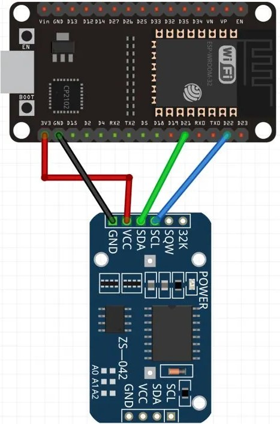

# Proyecto de Ejemplo

Este proyecto demuestra cómo utilizar ESP-IDF para implementar la comunicación entre dos nodos ESP32 a través de ESP-NOW. Un nodo lee la fecha y hora de un módulo DS3231 y transmite la información al otro nodo utilizando ESP-NOW.

## Cómo Usar el Ejemplo

1. Clona o descarga este proyecto.
2. Sigue las instrucciones en la [página de documentación](https://docs.espressif.com/projects/esp-idf/en/latest/api-guides/build-system.html#start-a-new-project) para iniciar un nuevo proyecto con ESP-IDF.
3. Asegúrate de tener instalado ESP-IDF y las herramientas necesarias.
4. Compila y carga el proyecto en dos nodos ESP32 diferentes.

## Contenido de la Carpeta del Ejemplo

- **main.c**: Este archivo contiene el código fuente principal que implementa la lectura de la fecha y hora desde el DS3231 y la transmisión por ESP-NOW.

- **CMakeLists.txt**: Archivo de configuración para el sistema de construcción CMake.

- **main/CMakeLists.txt**: Archivo de configuración específico para la carpeta 'main'.

- **README.md**: Este archivo que estás leyendo actualmente.

## Configuración del Proyecto

Asegúrate de ajustar la configuración de los pines I2C (SDA y SCL) y la dirección MAC del nodo remoto en el archivo `main.c` según tus requisitos.

En la siguiente figura se muestra el diagrama de conexión entre el ESP32 y el RTC DS3231.

## Objetivo del Proyecto

Este proyecto proporciona un punto de partida simple para implementar la comunicación entre nodos ESP32 utilizando ESP-NOW. Puedes utilizar este ejemplo como plantilla para tus propios proyectos.

